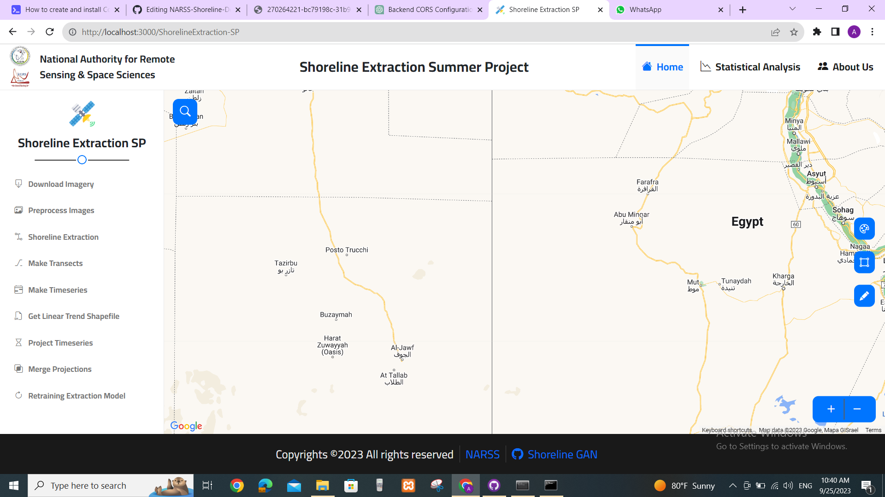
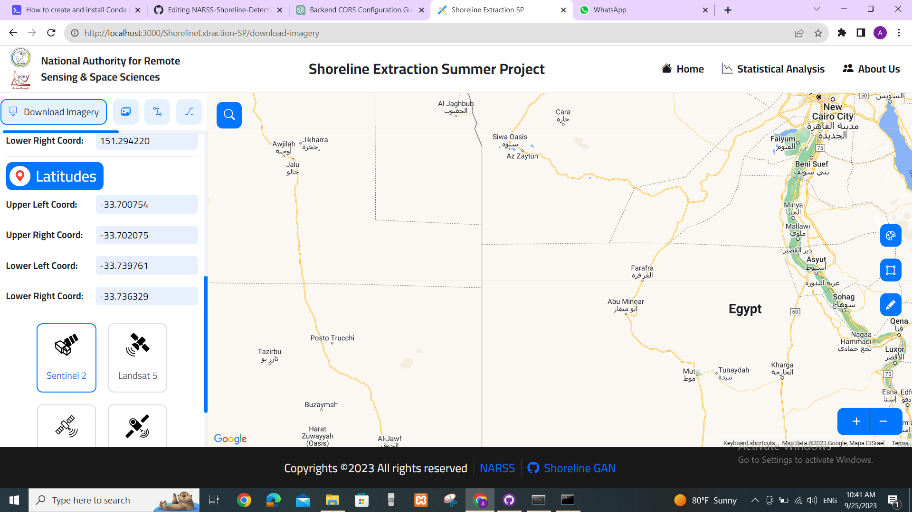
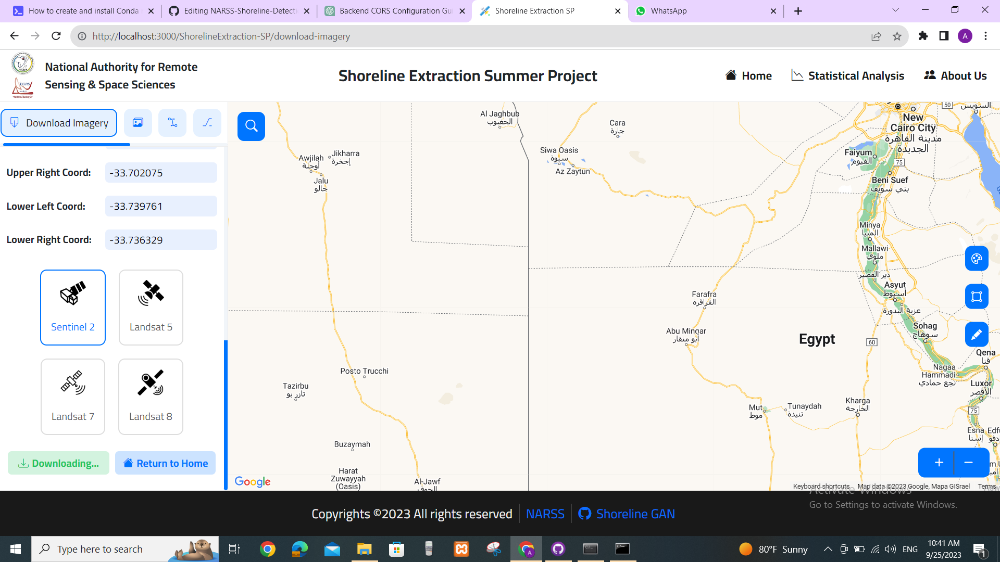
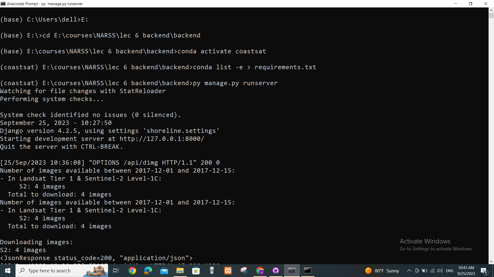
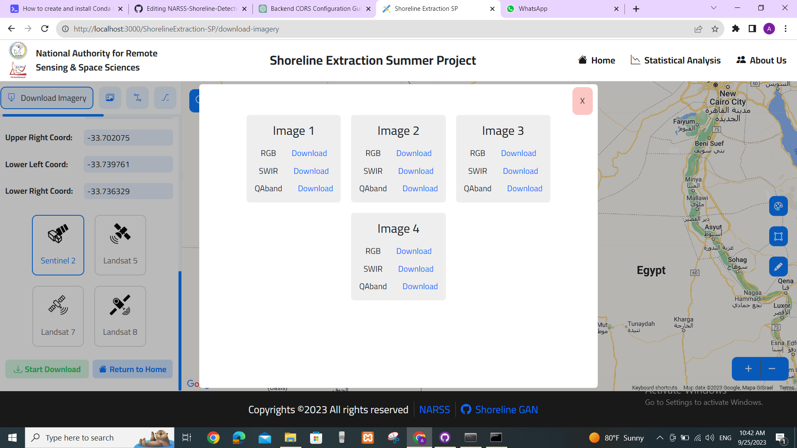

# NARSS-Shoreline-Detection-Web-Application
 in this project we will detect the shoreline in the user specified area through web application

 First, you need to activate the backend. You'll require the Conda package installer to install the dependencies of the environment, all of which are listed in the requirements file in the backend folder.

Right now, the only implemented function is 'dimg.' This function is used to download images from GEE (Google Earth Engine) using the open-source 'coastsat' repository, specifically by modifying a script called 'SDS.download.

paraphrased text on how to install the dependencies of coastsat:
"
To run the toolbox you first need to install the required Python packages in an environment. To do this we will use **Anaconda**, which can be downloaded freely [here](https://www.anaconda.com/download/). If you are a more advanced user and have **Mamba** installed, use Mamba as it will install everything faster and without problems.

Once you have it installed on your PC, open the Anaconda prompt (in Mac and Linux, open a terminal window) and use the `cd` command (change directory) to go the folder where you have downloaded this repository.

Create a new environment named `coastsat` with all the required packages by entering these commands in succession:

```
conda create -n coastsat
conda activate coastsat
conda install -c conda-forge geopandas earthengine-api scikit-image matplotlib astropy notebook -y
pip install pyqt5
```
"
after activating coastsat venv 

write this command

    pip install Django==4.2.5

cd to go to the "backend" directory

then write thie command to activate the server

    py manage.py runserver

to activate the frontend open cmd on the "frontend" directory then write this command after install node.js

    npm start
    
















 
 


